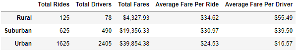
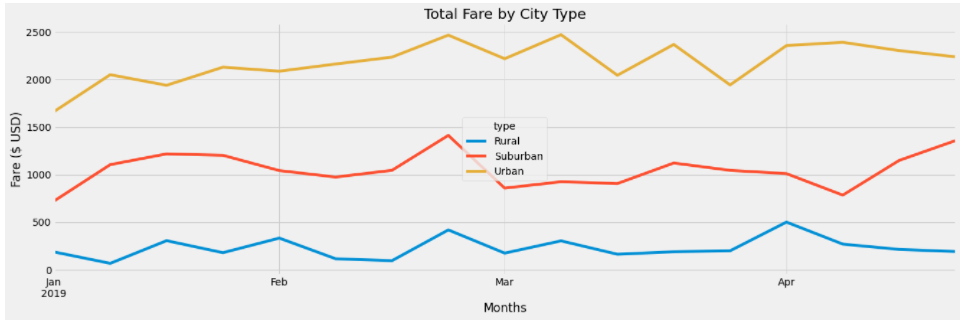

# PyBer Ride Data Analysis

## Contents
- [Overview of the Project](#overview)
- [Files](#files)
- [Results](#data-analysis-results)
- [Summary](#summary)

## Overview
The purpose of this analysis is to understand differences in ride-sharing behavior for different city types - rural, urban and suburban. Data is available several cities that fall into each of these categories. Work involves summarizing the data by city type and analyzing fares to infer ride-sharing habits in each of these city types. Pandas and Matplotlib were used for the analysis.

## Files
- Pyber_Challenge.ipynb - Contains code and all the required output dataframes

## Data Analysis Results

### Summary by City Type
Data from two separate tables were combined to arrive at a summary of ride-sharing data by city type. The summary data frame is shown below:

It can be inferred from the table that ride-sharing is more prevalent in urban areas compared to rural and suburban. This could be driven by the population density in these areas and the larger number of drivers, as seen in the table. The urban areas also bring in the most revenue driven by significantly higher number rides compared to rural and suburban areas. However, the average fare per ride and per driver in urban areas are lower in comparison. This could be a direct result of shorter distances traveled within these areas. Another possibility is lower unit cost (fare per mile) in urban areas, which is not obvious from the data.

### Weekly Fare Analysis

The chart above shows total fare for each of the different city types for the first four months of 2019. As discussed in the previous section, it can be seen that urban areas bring in the most amount of revenue in any given month. Rural areas lag suburban and urban areas by 4 to 8 times. Revenues vary from week to week, but no appreciable pattern has been observed. 

### Summary
Analysis of ride-sharing data shows significant disparity in fare revenues between each of the different city types. Here are three potential ways to address this disparity:
1. Address driver count disparity by attracting more drivers in rural and suburban areas. This could mean a marketing campaign, or potential increase in wages for drivers in these areas.
2. Run promotional campaigns with reduced fares to attract more people in rural and suburban areas to try ride-sharing. While potentially diminishing revenues in the near-term, such a campaign could prove beneficial in the long-term.
3. Increase unit fare in urban areas. While this does not address the problem of disparity between the different areas, it could improve revenues in urban areas. However, other factors like competition need to be considered in this scenario.